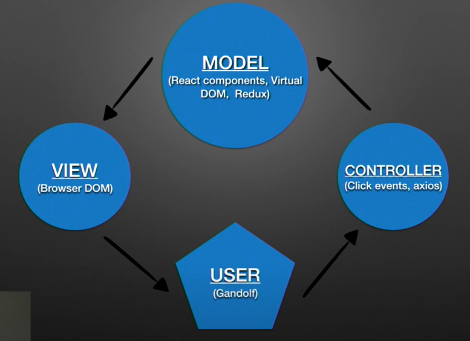
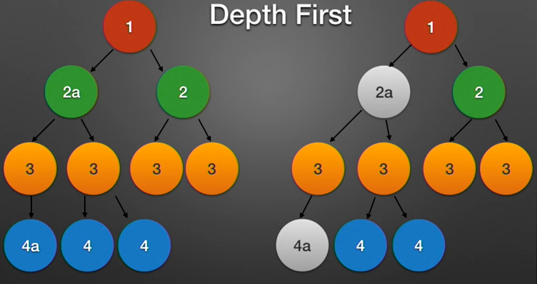
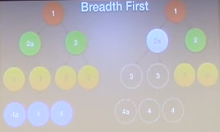

## MVC 经典分层

**Modle** - 用于管理数据和支配应用运行，即 React Component。

**View** - 指整个 React 应用在浏览器中实际渲染的 DOM 结构。

**Controller** - 能让接收用户的输入，从而改变 Modle 和 View 层，比如点击事件和 api 请求调用。

## Virtual DOM 虚拟化节点

- 使用 Javascript(JSON) 对象来表示浏览器 DOM
- 超快速对比浏览器真实的 DOM
- 能够每秒生成 20 万个虚拟 DOM 节点
- 当每次 setState 或者 dispatch 时，从副本中完整拷贝创建

## Diffing Algorithm 对比算法

React 就与两个假设推出了一个启发式的创新算法：

1. 两个类型不相同的节点将生成不同的树；
2. 开发者可以通过在 props 中使用 key 来给出提示，从而为子元素的渲染提供稳定的保证，实际上，这些假设对大多数场景都是有价值的；
3. 当对比两个相同类型的 React DOM 元素时，React 检查他们双方的属性，与 DOM 节点保持相同，只修改改变的节点。对于 Style 样式来说也是同样的方式；
4. 计算一次真实有效的微小差异在使用算法时最好的情况下复杂度是O(n^3)；
5. React 使用最优的情况下能将他们的复杂度提高到 O(n)；
6. 如果发现一个节点不同（不同类型或者不同组件），它将重新渲染整个子树。
7. React 广度优先的方式穿过树；
8. 这也确保了节点如果一个父节点需要修改时，其子节点也必须修改；

以上是深度优先（DFS）

以上是广度优先（BFS）

广度优先当遍历到 **2a** 时，它的整个子节点将重新渲染，不会再搜索 **4a** 了。

## Browser DOM 改变

当 react 创建一个虚拟 DOM 然后与旧的对比，创建出一组与浏览器 DOM 最小的差异。

当完成这一些列操作后，将以最快的速度开始所有的改变。

要实现这个只能持续的写循环而无需重新绘制直到结束。

重绘是指浏览器进程表现出重新计算页面元素的位置，图形，以及颜色。
