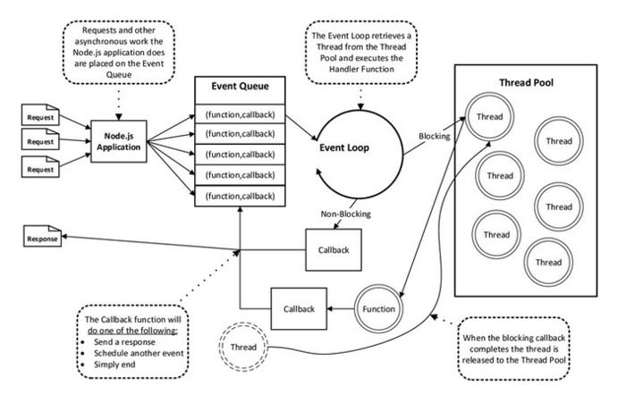

> Nodejs 为什么是单线程且支持高并发的脚本语言？

## 优缺点分析

**Node.js 的优点**：I/O 密集型处理（node的I/O请求都是异步的，如：sql查询、文件流操作、http请求……）；异步I/O?
顾名思义就是异步的发出 I/O 请求。

**Node.js 的缺点**：不擅长cpu密集型的操作（因为 Node.js 是单线程的）。
即复杂的运算、图片的操作等。

要理解 Node.js 的原理，可能还需要了解一些多线程或者并发的基本知识。

Node.js 的单线程指的是主线程是“单线程”，由主线程去按照编码顺序一步步执行程序代码，假如遇到同步代码阻塞，主线程被占用，后续的程序代码就会被卡主。

Node.js 的单线程只是一个 js 主线程，本质上的一步操作还是由线程池完成的。

Node.js 将所有的阻塞操作都交给了内部的线程池去实现，本身只负责不断的往返调度，并没有进行真正的 I/O 操作，从而实现异步非阻塞 I/O。

每个 Node.js 进程只有一个主线程在执行程序代码，形成一个执行栈（execution context stack)。

主线程之外，还维护了一个"事件队列"（Event queue）。当用户的网络请求或者其它的异步操作到来时，Node 都会把它放到 Event Queue 之中，此时并不会立即执行它，代码也不会被阻塞，继续往下走，直到主线程代码执行完毕。

主线程代码执行完毕完成后，然后通过 Event Loop，也就是事件循环机制，开始到 Event Queue 的开头取出第一个事件，从线程池中分配一个线程去执行这个事件，接下来继续取出第二个事件，再从线程池中分配一个线程去执行，然后第三个，第四个。主线程不断的检查事件队列中是否有未执行的事件，直到事件队列中所有事件都执行完了，此后每当有新的事件加入到事件队列中，都会通知主线程按顺序取出交 EventLoop 处理。当有事件执行完毕后，会通知主线程，主线程执行回调，线程归还给线程池。

主线程不断重复上面的第三步。

## Refrence

[[1] Nodejs 单线程 高并发](https://www.cnblogs.com/chang290/archive/2013/11/22/3437616.html)
