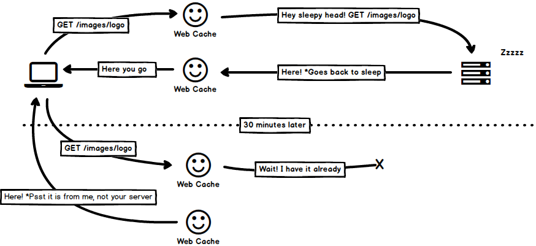
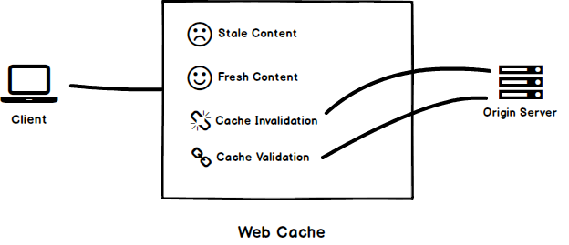
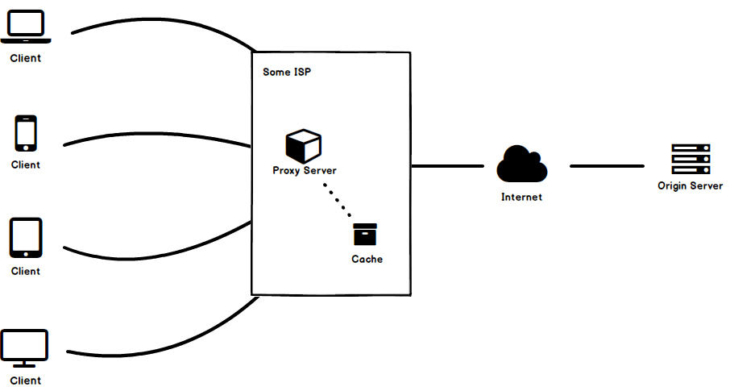
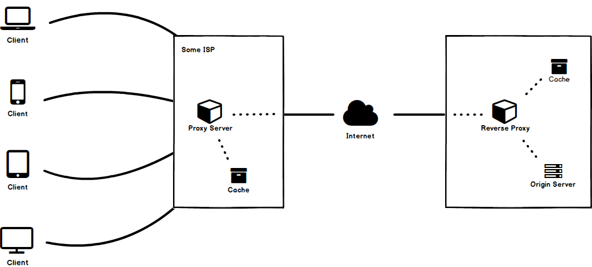

作为用户，我们很容易对缓存视频、加载耗时数秒的图片、以及因为内容正在加载而卡住的页面感到不耐烦。从缓存加载资源要比从原始服务器获取资源快得多。缓存减少了网络延迟，加速了资源的加载，减少了服务器上的负载，降低了带宽成本等等。

## 介绍

什么是 web 缓存？它位于客户端和服务器之间，不断地查看请求及其响应，寻找任何可以缓存的响应。这样当再次提出同样的请求时，消耗的时间就少了。



:::note

为便于理解，上图仅仅是一个概念。根据缓存的类型，实现它的位置可能会有所不同，稍后会详细介绍。

:::

在深入讨论细节之前，让我先概述一下本文将使用的术语：

- **客户端**可以是您的浏览器或请求服务器提供某些资源的任何应用程序
- **远程服务器**，是资源的实际来源，存放客户端所需的所有内容，并负责满足客户端请求
- **过期内容**是缓存但过期的内容
- **新内容**是缓存中尚未过期的可用内容
- **缓存验证**是与服务器通讯后检查缓存内容的有效性并更新过期时间的过程
- **缓存失效**是删除缓存中可用的任何过期内容的过程



## 缓存位置

Web 缓存可以是共享开放的或私有的，这取决于它存在的位置：

- [浏览器缓存](./cache-policy#浏览器缓存)
- [代理缓存](./cache-policy#代理缓存)
- [反向代理缓存](./cache-policy#反向代理缓存)

### 浏览器缓存

你可能已经注意到，当你在浏览器中点击后退按钮时，加载页面所花的时间比第一次加载所花的时间要少;这是运行中的浏览器缓存。浏览器缓存是最常见的缓存位置，浏览器通常会为缓存保留一些空间。


浏览器缓存只限于一个用户，不像其他缓存，它可以存储“私有”响应。后面会详细介绍。

### 代理缓存

与浏览器缓存服务于单个用户不同，代理缓存可能服务于数百个访问相同内容的不同用户。它们通常由 isp 或其他独立实体在更广泛的层面上实施。



### 反向代理缓存

反向代理缓存或代理缓存是在靠近原始服务器的地方实现的，用以减少服务器上的负载。代理缓存不同于由 isp 等实现的减少网络带宽使用的代理缓存，代理或反向代理缓存是由服务器管理员在靠近原始服务器的地方实现的，以减少服务器上的负载。



虽然您可以控制反向代理缓存(因为它是由您在您的服务器上实现的)，但您不能避免或控制浏览器和代理缓存。如果你的网站没有正确配置使用这些缓存，它仍然会被缓存使用这些缓存的默认设置。

## 缓存头

那么，我们如何控制 web 缓存呢？每当服务器发出响应时，都会伴有一些 HTTP 头来指导缓存是否缓存以及如何缓存此响应。内容提供者必须确保返回正确的 HTTP 头，以告知缓存如何缓存内容。

### Expires

在 HTTP/1.1 和引入缓存控制之前，有一个 `Expires` 头，它只是一个时间戳，告诉缓存一些内容需要多长时间才能被认为是最新的。此标题的可能值是绝对过期日期，且日期必须是 GMT 时间。下面是示例：

```http
Expires: Mon, 13 Mar 2017 12:22:00 GMT
```

需要注意的是，日期不能超过一年，如果日期格式错误，内容将被认为过时。另外，缓存上的时间必须与服务器上的时间保持同步，否则可能无法实现所需的结果。

虽然 `Expires` 头仍然有效并且被缓存广泛支持，但是我们应该优先考虑它的 HTTP/1.1 继承者，即 `Cache-Control`。

### ~~Pragma~~

另一个老版本是在 HTTP/1.1 中出现的 **Pragma**。现在，我们光使用下面给出的 cache-control 头，就能在浏览器中，实施缓存策略。然而，关于它，我想指出的一件事是，你可能会看到 `Pragma: no-cache` 被到处使用，试图用来阻止响应被缓存。它可能不一定有效；正如 HTTP 规范在请求标头中讨论的那样，在响应标头中并没有提到它。相反，应该使用 `Cache-Control` 头来控制缓存。

### Cache-Control

`Cache-Control` 指定缓存内容的时间和方式。这个系列的报头是在 HTTP/1.1 中引入的，以克服 `Expires` 报头的局限性。

缓存控制头的值是复合的，也就是说，它可以有多个指令/值。让我们看看这个头可能包含的值。

#### private

将缓存设置为 private（私有）意味着内容不会被缓存到任何代理中，它只会被客户端(即浏览器)缓存。

```text
Cache-Control: private
```

话虽如此，但不要让它把你搞糊涂了，以为设置这个头就能让你的数据绝对安全；为此，你仍然必须使用 SSL。

#### public

如果设置为 public（公开），那么除了被客户端缓存外，还可以被代理缓存；为其他使用者提供服务。

```text
Cache-Control: public
```

#### no-store

`no-store` 表示任何内容都不应该被缓存。

```text
Cache-Control: no-store
```

#### no-cache

`no-cache` 表示缓存可以维护，但是缓存的内容在被服务之前需要从服务器重新验证（例如使用 ETag）。也就是说，仍然会有一个对服务器的请求，但是是用于验证，而不是下载缓存的内容。

```text
Cache-Control: max-age=3600, no-cache, public
```

#### max-age: seconds

`max-age` 指定缓存内容的秒数。例如，如果缓存看起来像下面:

```text
Cache-Control: max-age=3600, public
```

这意味着内容是可公开缓存的，60 分钟后就会被认为过时。

#### s-maxage: seconds

`s-maxage` 这里 `s-` 前缀表示共享。这个指令专门针对共享缓存。像 `max-age` 一样，它也可以获得缓存的秒数。如果存在，它将覆盖共享缓存的 `max-age` 和 `expires` 头。

```text
Cache-Control: s-maxage=3600, public
```

#### must-revalidate

如果网络出现问题，无法从服务器检索到内容，浏览器可能会在没有验证的情况下提供陈旧的内容。

`must-revalidate` 可以有效避免这种情况。如果存在此指令，则意味着在任何情况下都不能提供陈旧的内容，在提供服务之前必须从服务器重新验证数据。

```text
Cache-Control: max-age=3600, public, must-revalidate
```

#### proxy-revalidate

`proxy-revalidate` 类似于 `must-revalidate`，但它对共享或代理缓存指定了相同的方法。换句话说，代理重新验证是必须重新验证的，就像 `s-maxage` 之于 `max-age` 一样。但为什么不叫它 `s-revalidate` 呢？我也不知道。

#### Mixing Values

您可以以不同的方式组合这些指令来实现不同的缓存行为，但是 `no-cache/no-store` 和 `public/private` 是相互排斥的。

如果同时指定了 `no-store` 和 `no-cache`，则 `no-store` 的优先级高于 `no-cache`。

```text
<!--- 如果两种都声明：-->
Cache-Control: no-store, no-cache

<!--- 将被识别为：-->
Cache-Control: no-store
```

对于 `public/private`，对于任何未经身份验证的请求，缓存被认为是 `public`，对于任何经过身份验证的请求，缓存被认为是 `private`。

## Validators

到目前为止，我们只讨论了如何缓存内容和多长时间的缓存内容被认为是最新的，但我们没有讨论客户端如何从服务器进行验证。下面我们将围绕这一点进行讨论。

### ETag

Etag 或“实体标签”是在 HTTP/1.1 规范中引入的。Etag 只是服务器与某些资源连接的唯一标识符。这个 ETag后来被客户端用于生成条件 HTTP 请求声明：


## Reffers

[[1] http cache](https://roadmap.sh/guides/http-caching#proxy-cache)