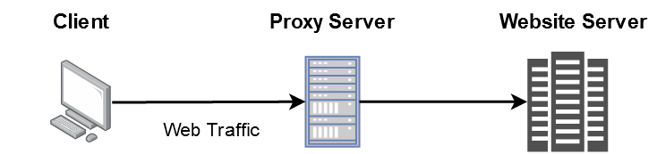
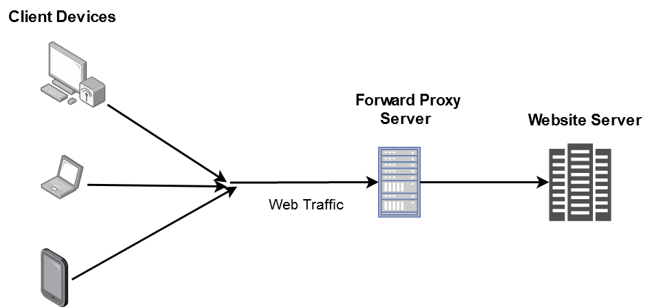
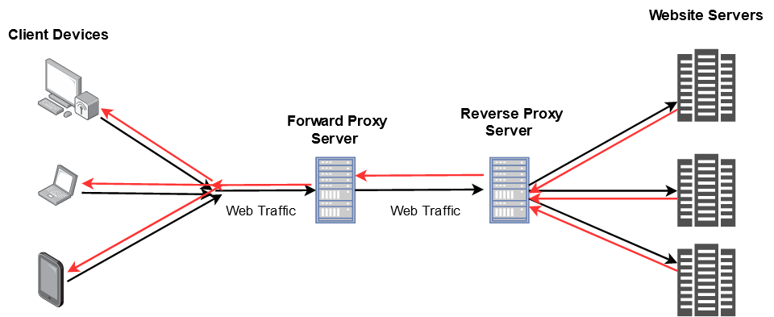

互联网使用社交媒体，音频/视频通话功能把全世界的人连接起来，它为人们提供了丰富的知识和工具。同时，它也伴随着网络安全和隐私被侵犯的潜在风险。于是我们有必要提到，在防范网络安全隐患中扮演重要角色的**代理**，主要包含以下方面：

## 代理服务器

**每个从客户端到服务器的网络请求都要经过某种类型的代理服务器。**一个代理服务器在客户端（你）和网络中间，将终端用户和你浏览的网站分开，并扮演着网关的角色。将 web 请求的源 IP 地址替换为代理服务器的 IP 地址，然后将其转发给 web 服务器。web 服务器无法察觉到客户端，它只能看到代理服务器。

:::note

为了便于理解，上图仅作简要说明。

:::

代理服务器作为单点控制，使安全策略更容易开展和实施。同时，代理服务器还提供了缓存机制，用来存储被请求的 web 网页，从而提高整个应用的性能。如果请求的网页在缓存内存中是可用的，那么它就不会将请求转发给 web 服务器，而是将缓存的网页发回给客户端。这种办法通过减少服务器的负载，可以支撑起网站每天数百万用户的访问，从而为**大公司节省了大量资源开销**。

## 转发代理服务器

转发代理通常在客户端实现，**位于多个客户端**或源客户端之前。转发代理服务器主要用于公司管理员工的**互联网使用**和**限制内容**。它也被用作**防火墙**，通过阻止任何可能对公司网络构成威胁的请求来保护公司的网络。代理服务器还可以**绕过地理限制**，浏览用户所在国家可能被屏蔽的内容。它允许用户**匿名浏览**，因为代理服务器在网站服务器上隐藏了他们的详细信息。

:::note

为了便于理解，上图仅作简要说明。

:::

## 反向代理服务器

反向代理服务器是在**服务器端**而不是客户端实现的。它**位于多个 web 服务器前**，通过将请求转发到 web 服务器来管理传入的请求。它为**后端 web 服务器而不是前端客户端**提供匿名性。反向代理服务器通常用于代替 web 服务器执行**身份验证**、**内容缓存**和**加密/解密**等任务。这些任务会**占用 web 服务器的 CPU 周期**，引发大量的网页加载延迟降低网站的性能。反向代理还被用作**负载均衡器**，以便在 web 服务器之间有效地分配传入流量，但它**并没有针对以上提到的这些任务进行优化**。本质上讲，反向代理服务器是一台 web 服务器或一组 web 服务器的网关。

:::note

为了便于理解，上图仅作简要说明。红线代表服务器响应，黑线代表从客户端传入的请求。

:::

## 综述

代理服务器充当客户端（你）和 Internet 之间的网关，并将终端用户与您浏览的网站分开。**代理服务器在网络上的位置决定了它是转发代理服务器还是反向代理服务器。**转发代理是在客户端实现的，它位于**多个客户端或源客户端前**，并将请求转发给 web 服务器。反向代理服务器是在**服务器端**实现的，它位于**多个 web 服务器的前面**，通过将请求转发到 web 服务器来管理传入的请求。

如果上面说的这些让你难以理解，这里有一个简单的类比。

在餐馆里，服务员会把你点的菜交给厨师长。然后厨师长发出命令，并给厨房里的每个人分配任务。

在这个比喻中:

- 你就是客户端
- 你点菜就是发出一个 web 请求
- 餐厅服务员是你的转发代理服务器
- 厨师长就是反向代理服务器
- 其他在厨房里忙活的厨师就是 web 服务器

## Refers

[[1] Ebrahim Bharmal https://roadmap.sh/guides/proxy-servers](https://roadmap.sh/guides/proxy-servers)