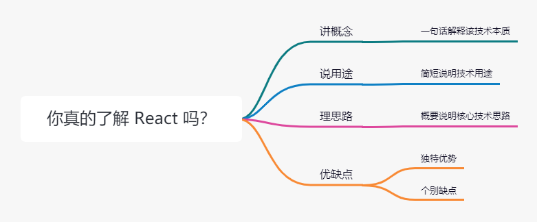

> 谈谈你对 React 的理解？

## 🎯 破题

👎 坑：~~想到哪，回答到哪，线性思维，单向，仅凭知觉，篇片面作答~~

问：如何解释 React 是什么？

答：React 是一个库。

问：能补充一下吗？

答：React 特点声明式，组件化，一次学习随处编写

... （这时应聘者已经丧失主动权）。

👍 「讲、说、理、列」

- 讲概念：就一句话说清楚这个技术是什么
- 说用途：结合具体场景说用途，拓展性描述
- 理思路：梳理技术核心思路和运作流程，可展开说明
- 列优缺点：对技术方案进行优缺点列举，横向对比，切忌踩一捧一，客观全面。

## 🔢 承题

### 1. 概念

> A JavaScript library for building user interfaces

React 是一个用于构建 UI 用户界面的 JS 库。

回顾历史，React 诞生于 Jquery，Angulerjs，Backbonejs 相继流行的时代。

2005 年的 jquery, 封装 DOM 操作，ajax 等 Api。但本质上只是一个工具函数集合。

2009 年，页面变得更加复杂，如何组织代码，提升复用率，成为正待解决问题， Angularjs 横空出世，路由，双向绑定，指令，组件等概念。更适合后台管理系统，但是写一般页面复杂度有点高，过于繁琐。

2010 年，Backbone.js 出现，为了解决 Angularjs 的繁琐，同时引入 MVC 概念有序的解决前端代码组织混乱的问题。大量 jq 老项目都可以迁移过来。

之前是以页面的维度思考，加上一些 jq 零星的插件。React 的出现，组件概念的提出，使得组件作为基本单位可通过编写单元测试进维持稳定性。

> View = fn(props)

复杂一点的话可以这样还描述：

> View = fn(props, state, context)

即使分为类组件，纯函数组件，也不妨碍表达一个以上的结论，如同经典公式忽略了外界干扰因素，但并不妨碍它揭示了一个重要结论。

> E=mc2

组件化的概念，遵循了设计模式：组合优于继承。因此，从本质上讲，React 是一个组件化框架。

### 2. 用途

React 用于构建视图，当然不仅仅是 Web 上的 UI 界面，由于 React 采用虚拟 DOM，这就使得它可以运行在其他的终端设备上，比传统 Web 框架的应用更加广泛。

使用场景：

- Web 端无论 PC 和移动，本质上都是网页技术，React 都支持
- React Native 技术可以用 Web 的方式编写 IOS 和 Andriod 跨平台应用
- React 360 用于开发 VR 应用
- 还有冷门的 ink，用 React 开发命令行应用

可以说虚拟 DOM，使得 React 的使用场景极大丰富。

### 3. 核心思路

一）声明式：

直观一目了然，方便组合：

👎 命令式

```js
// HTML
<div class="block"></div>
// JSX
const block = $('.block');
block.css('color', 'red');
```

👍 声明式

```jsx
const Block = (props) => <div style={{ color: 'red' }}></div>
```

二）组件化

组件化可以降低系统间功能的耦合性，提高功能内部的聚合性。

放弃 ~~模板语法~~，使用声明式的 JSX。

三）通用性

虚拟 DOM 使得开发者无需直接操作 DOM，正因为这一层封装，React 能够出现更繁荣的生态，无论 Web, Native, VR 还是 Shell 命令，只要兼容虚拟 DOM 层，就可以直接运行 React，这也是为什么我们在写 Web 应用时经常需要与 React DOM 库搭配使用。

四）优缺点

优点：声明式，组件化，通用性

缺点：并非一揽子框架，比如路由解决方案 React Router 交给社区实现，导致技术选型和学习使用上，对初学者还是有成本的。正因为社区的蓬勃发展，也诞生了 Dvajs 等非官方解决方案。因此， React 是一个贫富差距极大，使用者水平上下限差距极大的框架，自由度过高。当然后面有 Creact-React-App 慢慢解决了这一点。

## 💯 答题



> React 是一个用于构建 UI 用户界面的 JS 框架。<br/>
> 通过组件化的方式解决了视图层开发复用的问题，本质上是一个组件化的框架。
>
> 它的核心设计思路有三点，分别是声明式，组件化和通用性。
>> 1. 声明式的优势在于直观与方便组合；<br/>
>> 2. 组件化的优势在于视图的拆分和模块复用，更容易做到高内聚低耦合；<br/>
>> 3. 通用性在于一次学习，随处编写，比如在 React Native，React 360 等；
>
>> 👍 优点：React 的通用性优势，归功于它使用了[虚拟 DOM]([ffsdf](http://assets.processon.com/chart_image/5fdf6b9a63768907e4aa8ea1.png))，这使得 React 的适用范围变得更加广阔，无论 Web、Native、VR，甚至是 Shell 应用都能灵活开发。<br/>
>> 👎 缺点：作为一个视图层的框架，官方并不提供一揽子的解决方案，而是交给社区去实现，比如路由管理方案 React Router，全局状态管理方案 Redux，这样增加了技术选型的成本，以及对初学者上手难度上造成一定的干扰。
> 
> 但不可否认的是，Facebook 以拥抱社区、拥抱开源的方式，确实促进了 React 生态的繁荣。
