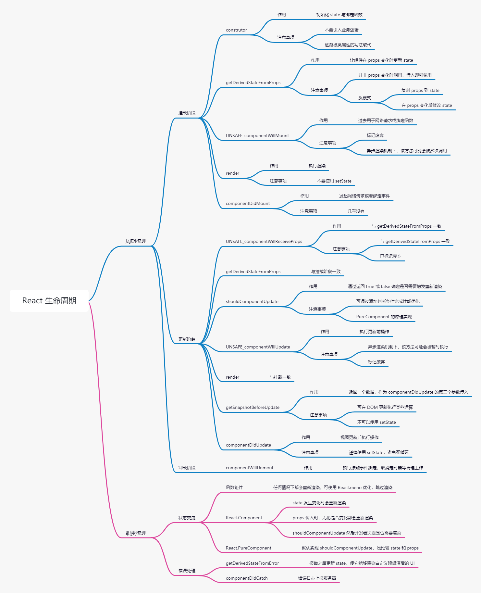

> 避免生命周期中的坑需要做好两件事：
>> 1. 你不要在不恰当的时候调用不该调用的代码；
>> 2. 在需要调用的时候，不要忘记调用
>
> 主要有 7 种情况容易造成生命周期的坑：
>> 1. getDeriverdStateFromProps 容易造成反模式，使得受控组件和非受控组件区分模糊
>> 2. componentWillMout 已标记弃用，主要原因是在新的异步架构下会导致多次被调用，因此网络请求推荐放到 componentDidMount
>> 3. componentWillRecieveProps 已标记弃用，被 getDeriverdStateFromProps 取代，主要原因是性能问题
>> 4. shouldComponentUpdate 通过返回 true 或 false 确定是否需要重新渲染，用于优化性能
>> 5. componentWillUpdate 已标记弃用，可结合 getSnapshotBeforeUpdate 与 componentDidUpdate 改造使用
>> 6. 如果在 componentWillUnmout 函数中忘记解除事件绑定，取消定时器等清理操作，容易引发 Bug
>> 7. 如果未添加错误处理边界，并通过 componentDidCatch 捕获处理，则用户将看到一个无法操作的白屏

