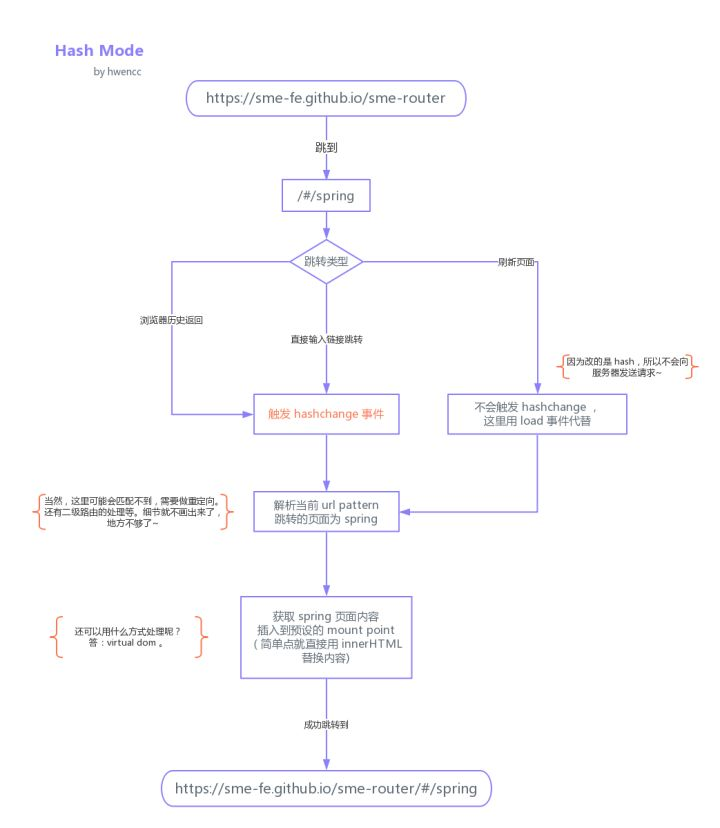
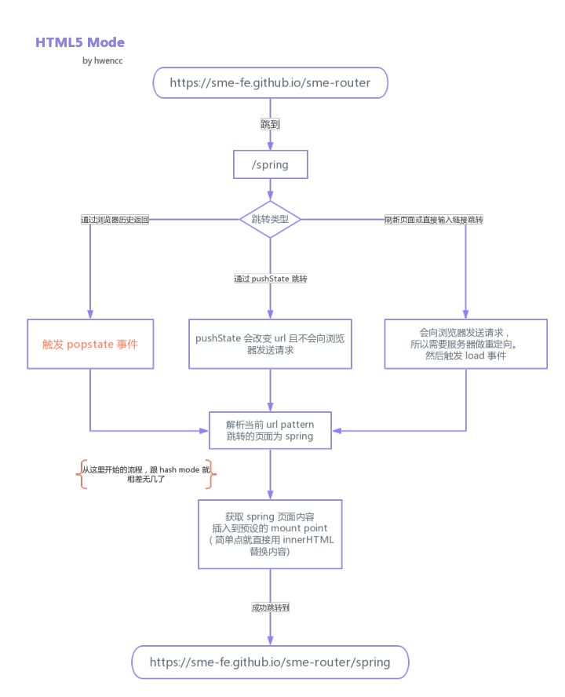

前端路由的概念出自**单页应用**（Single Page Application 简称：SPA），它的实现其实并不复杂，本质就是监听 URL 的变化，然后匹配路由规则，渲染对应的组件，达到切换页面的效果，这一过程无需浏览器刷新。目前单页应用中使用的路由就只有两种实现方式：

- hash 模式
- history 模式

为了便于理解，我们先讨论一下路由的概念，以及前端路由的起源。

## 路由

路由这个概念最先是**后端**即服务端出现的。在以前用模板引擎开发页面时，经常会看到这样:

```text
http://hometown.xxx.edu.cn/bbs/forum.php
```

有时还会有带 `.jsp` 或 `.html` 的路径，这就是所谓的 SSR(Server Side Render)。

通过服务端渲染，直接返回页面。其响应过程是这样的：

1.浏览器发出请求

2.服务器监听到 80 端口（或443）有请求过来，并解析 url 路径

3.根据服务器的路由配置，返回相应信息（可以是 html 字串，也可以是 json 数据，图片等）

4.浏览器根据数据包的 `Content-Type` 来决定如何解析数据简单来说路由就是用来跟后端服务器进行交互的一种方式，通过不同的路径，来请求不同的资源，请求不同的页面是路由的其中一种功能。

甚至在前端开发者比较熟悉的 **Nodejs** 框架 [Express][3] 中：

```js
app.get('/about', function (req, res) {
  res.send('about')
})

app.get('/users/:userId/books/:bookId', function (req, res) {
  res.send(req.params)
})
```

我们还能看到 RESTful API 的路由规则定义。

## 前端路由

前端路由的出现，要追溯到 **Ajax** 全称 (Asynchronous JavaScript And XML)，是浏览器用来实现异步加载的一种技术方案。

在 90s 年代初，大多数的网页都是通过直接返回 HTML 的，用户的每次更新操作都需要重新刷新页面。及其影响交互体验，随着网络的发展，迫切需要一种方案来改善这种情况。

1996，微软首先提出 iframe 标签，iframe 带来了异步加载和请求元素的概念，随后在 1998 年，微软的 Outloook Web App 团队提出 Ajax 的基本概念（XMLHttpRequest的前身），并在 IE5 通过 ActiveX 来实现了这项技术。

在微软实现这个概念后，其他浏览器比如 Mozilia，Safari，Opera 相继以 XMLHttpRequest 来实现 Ajax。

在 IE7 发布时，微软选择了妥协，兼容了 XMLHttpRequest 的实现。有了 Ajax 后，用户交互就不用每次都刷新页面，体验带来了极大的提升。但真正让这项技术发扬光大的，还是后来的 Google Map，它的出现向人们展现了 Ajax 的真正魅力，释放了众多开发人员的想象力，让其不仅仅局限于简单的数据和页面交互，为后来异步交互体验方式的繁荣发展带来了根基。

而异步交互体验的更高级版本就是 SPA —— 单页应用。单页应用不仅仅是在页面交互是无刷新的，连页面跳转都是无刷新的，为了实现单页应用，所以就有了前端路由。单页应用的概念是伴随着 MVVM 出现的。最早由微软提出，然后他们在浏览器端用 [Knockoutjs][1] 实现。但这项技术的强大之处并未当时的开发者体会到，可能是因为 Knockoutjs 实现过于复杂，导致没有大面积的扩散。同样，这次接力的选手依然是 Google。Google 通过 [Angularjs][2] 将 MVVM 及单页应用发扬光大，让前端开发者能够开发出更加大型的应用，职能变得更大了。随后，前端圈开始得到了爆发式的发展，陆续出现了很多优秀的框架。

## Hash 路由

`github.com/Turkyden/#/` 就是 Hash URL，当 `#` 后面的哈希值发生变化时，不会向服务器请求数据，可以通过 `hashchange` 事件来监听到 URL 的变化，从而进行跳转页面。



```html
<a href="#home">home</a>
<a href="#about">about</a>
<div id="app"></div>
```

```js {1}
window.addEventListener('hashchange', onHashChange);
onHashChange();
function onHashChange() {
  let router = document.getElementById('app');
  router.innerText = location.hash;
}
```

## History 路由

History 模式是 HTML5 新推出的功能，比之 Hash URL 更加美观。



```html
<a href="#home">home</a>
<a href="#about">about</a>
<div id="app"></div>
```

```js {1,7,8}
window.addEventListener('popstate', popState);
var router = document.getElementById('app');
popState();
var aList = document.querySelectorAll('a[href]');
for(let i = 0;i < aList.length;i++){
  aList[i].addEventListener('click', function (ev) {
    ev.preventDefault();
    history.pushState(null, '', aList[i].getAttribute('href'))
    popState();
  })
}
function popState() {
  router.innerText = location.pathname;
}
```

## React Router

通过以上演示，我们大致理解前端路由的实现原理，只不过为了演示方便，我们在渲染页面内容的时候，直接进行了 `innerText` DOM 操作。现代前端框架 React，Vue 等的出现，使得开发者不再需要直接操作 DOM，即可完成页面的重新渲染。那么，与这些框架配套的前端路由解决方案，也随之诞生，比如 react-router，vue-router 等，它们为前端开发者开发大型 SPA （单页应用）带来了无限可能。

[react-router][4] 是 react 技术栈下的前端路由库，它主要解决了 SPA 应用中的页面（组件）如何根据路由规则和 url 进行正确渲染的问题。当然，这一过程与 React 中的概念 [vitual dom][5] 和 diff 算法有关。

## 服务端渲染路由

[1]: https://knockoutjs.com/
[2]: https://angularjs.org/
[3]: https://www.expressjs.com.cn/
[4]: https://github.com/ReactTraining/react-router
[5]: ./virtual-dom