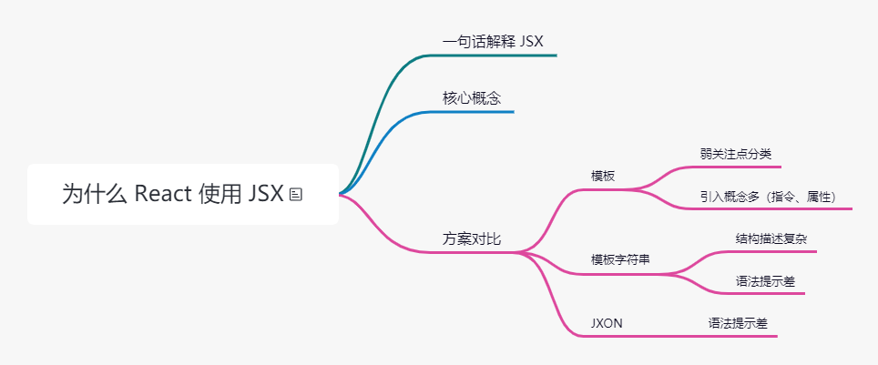

> 为什么不选择 A、B、C ？

## 🎯 破题

面试官考察什么？

- 技术广度，深挖知识面，对流行框架模板方案是否了解
- 技术方案调研能力

👎 ~~“因为 JSX 简单易用，React 官方推荐指定”~~

👍 拿出更多的方案和竞品横向比较，充分说明 JSX 是 React 的必然选择

## 🔢 承题

✨ 三步走 「一句话解释、核心概念、方案对比」

一）一句话解释

按照 React 官方解释，**JSX 是一个 Javascript 的语法扩展，或者说是一个类似于 XML 的 ECMAScript 语法扩展**。Facebook 不想引入过多的概念，也不期望加入浏览器或者 ECMAScript 标准。

二）核心概念

React 本身不强制使用 JSX，你也可以通过 `React.createElement` 实现:

```jsx
 // ... res
 render() {
   return React.createElement('div', null, `Hello ${this.props.msg}`)
 }
```

但 JSX 的就像是一种语法糖，使用类似 XML 的描述方式描述函数对象，JSX 版可以这样写：

```jsx
  // ... res
 render() {
   return <div>Hello {this.props.msg}</div>
 }
```

这样代码就非常的简洁了，而且随着组件增多，代码层次结构变得非常清晰，XML 语法在树结构的描述上天生具有可读性强的优势。

但是 JSX 仅仅是写给程序员同行看的，实际运行的时候，使用 Babel 插件将 JSX 代码还原成 React.createElement 风格的代码。

> 既然能用插件转换代码，那为什么不直接使用模板呢？

三）方案对比

**关注点分离（Separation of concerns）**，是面向对象程序设计的核心概念，提倡每一部分仅关注各自的关注焦点。

React 中的关注点基本单位是组件，组件之间的耦合度很低，单个组件高内聚。

**模板**

虽然模板也能实现组件复用，但是 **React 团队认为引入模板是一种不佳的实践**。因为模板分离了技术栈，引入模板的同时还加入了更多的概念，比如模板语法、模板指令等。

```html
<div ng_bind="name" ng-model="name"></div>
```

**模板字符串**

代码结构变得复杂，开发工具代码提示非常困难：

```js
var box = jsx`
  <${Box}>
    ${
      // bala bala
    }
  </${Box}>
`
```

**JXON**

其结构类似 JSX, 但是 React 团队放弃是因为大括号不能为元素在树中开始和结束的位置，提供很好的语法提示。

```xml
<production>
  <category></category>
  <script type="text/javascript">
    <![CDATA[function do(a, b) {
      // bala bala
    }]]>
  </script>
</production>
```

## 💯 答题



> 在回答问题之前，我先解释一下什么是 JSX。JSX 是一个 JavaScript 的语法扩展，结构类似 XML。
>> JSX 主要用于声明 React 元素，但 React 中并不强制使用 JSX。即使使用了 JSX，也会在打包构建过程中，使用 Babel 插件编译为 React.createElement。所以 JSX 更像是 React.createElement 的语法糖。
>> 所以从这里可以看出，React 团队并不想引入 Javascript 以外的开发体系。而是希望通过合理的关注点分离保持组件开发的的纯粹性。
> 
> 接下来与 JSX 以外的三种技术方案进行对比。
> 
>> 1. 模板，React 团队认为模板不应该是开发过程中的关注点，会引入模板语法，模板指令等概念，这是一种不佳的实现方案。<br/>
>> 2. 模板字符串，模板字符串编写的结构会造成多次内部嵌套，使整个结构变得复杂，并且优化代码提示也会变得困难重重。<br/>
>> 3. JXON，同样是因为代码提示困难被放弃<br/>
>
> 所以 React 最后选用了 JSX，是因为 JSX 与其设计思想贴合，不需要引入过多的新概念，对编辑器的代码提示也极为友好。

**Babel 插件如何实现从 JSX 到 JS 的编译？**

```js
module.exports = function (babel) {
  var t = babel.types;
  return {
    name: "custom-jsx-plugin",
    visitor: {
      JSXElement(path) {
        var openingElement = path.node.openingElement;
        var tagName = openingElement.name.name;
        var args = [];
        args.push(t.stringLiteral(tagName));
        var attribs = t.nullLiteral();
        args.push(attribs);
        var reactIdentifier = t.identifier("React"); //object
        var createElementIdentifier = t.identifier("createElement");
        var callee = t.memberExpression(
          reactIdentifier,
          createElementIdentifier
        );
        var callExpression = t.callExpression(callee, args);
        callExpression.arguments = callExpression.arguments.concat(
          path.node.children
        );
        path.replaceWith(callExpression, path.node);
      },
    },
  };
};
```

.babelrc

```js
{
  "plugins": ["jsx-plugin", "./jsx-parse"]
}
```

jsx-pareser.js

```js
module.exports = function () {
  return {
    manipulateOptions: function manipulateOptions(opts, parserOpts) {
      parserOpts.plugins.push("jsx");
    }
  };
};
```